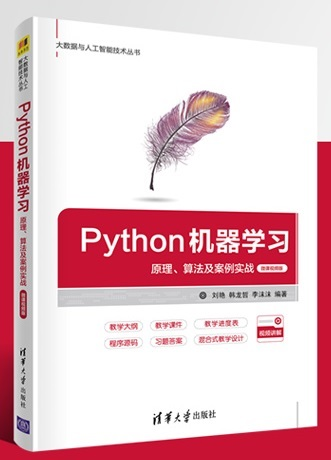

<h2> 刘艳</h2>
华东师范大学  数据科学与工程学院 
<table width="1141" border="0">
  <tbody>
    <tr>
      <td width="305"></td>
      <td colspan="2"><h2 class="Tit">个人简介:</h2>
        
于吉林大学计算机专业获得本科、硕士学位。

        
于华东师范大学获得博士学位。

        
现任职于华东师范大学数据科学与工程学院。

      
研究方向：图像处理、模式识别、人工智能、数据挖掘与数据分析、人工智能教育方法等。
</td>
    </tr>
    <tr>
      <td rowspan="2">
<strong>联系方式：</strong>

        
<a href="yliu@cc.ecnu.edu.cn">Email</a>

      
<strong>联系地址：</strong>

      
上海市普陀区华东师范大学计算机楼
</td>
      <td width="478" rowspan="2"><h2 class="Tit">工作简介:</h2>
        长期进行机器学习领域和跨领域的探索和研究，发表SCI、EI、CSCD、CCF等论文20余篇。 主编教材《Python机器学习》、《机器学习实践教程》等，副主编编写《机器学习方向本硕博培养体系》。        
        
        <ul>
          <li class="bd"> 上海市计算机等级考试命题专家</li>
          <li class="bd">国际会议审稿专家</li>
          <li class="bd">上海市计算机学会人工智能专委会委员</li>
          <li class="bd">上海市计算机能力大赛专家评委</li>
          <li class="bd">全国计算机设计大赛专家评委</li>
          <li class="bd">国际SCI期刊审稿专家</li>
          <li class="bd">Intel AI Lead Facilitator前沿导师</li>
          <li class="bd">与阿里云、英特尔中国等公司合作开展人工智能资源建设，与国家电网公司、爱奇艺等企业在智能安全、环境监测、智能娱乐等领域进行落地实施。</li>
          <li class="bd"> 在中国大学慕课开设《Python机器学习-解“码”人工智能》课程。</li>
          <li class="bd">阿里天池AI平台《人工智能基础》慕课</li>
          <li class="bd">“阿里慕课出海计划”课人工智能系列英文版课程</li>
          <li class="bd">《文汇报》2020年12月21日教育版专访</li>
          <li class="bd">            主讲教育部国际司“中国高校人工智能人才国际培养计划-2021年人工智能教师研讨班”，培育高校教师资源。</li>
        </ul></td>
      <td width="344" height="320" align="center">
&nbsp;

        

      <h4>《Python机器学习 原理、算法及案例实战》</h4></td>
    </tr>
    <tr>
      <td align="left">
购买链接：

        <ul>
          <li><a href="https://item.jd.com/13512590.html" target="_blank">京东</a></li>
          <li><a href="http://product.dangdang.com/29329111.html" target="_blank">当当</a></li>
          <li><a href="https://detail.tmall.com/item.htm?spm=a230r.1.14.18.337bdb46pcGwWv&id=659428760050&ns=1&abbucket=20" target="_blank">淘宝</a></li>
      </ul>
      
&nbsp;

      
&nbsp;
</td>
    </tr>
    <tr>
      <td>&nbsp;</td>
      <td><h2 class="Tit">主讲课程：</h2>
        <ul>
          <li class="bd">《Python机器学习》本科生、硕/博士生</li>
          <li class="bd">《人工智能基础》本科生、硕士生</li>
        </ul>
      
——“Python机器学习，从入门到不用放弃。”
</td>
      <td>&nbsp;</td>
    </tr>
  </tbody>
</table>
